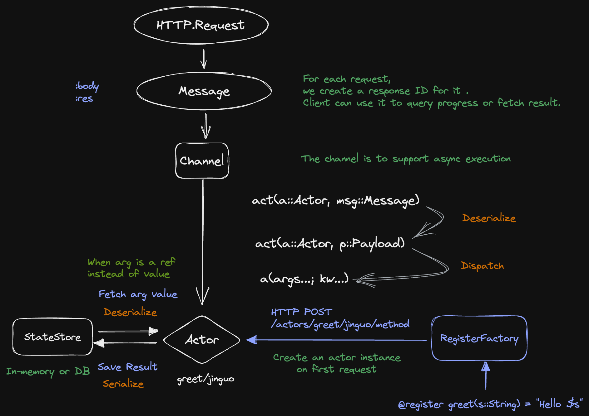

<a id='Design'></a>

<a id='Design-1'></a>

# Design





<a id='Overview'></a>

<a id='Overview-1'></a>

## Overview


<!–


  * What Jugsaw is
  * What we provide

      * For application developers

          * Bridge the gap between users and developers?
      * For general users

          * A world of ready-to-use applications?


–>


<a id='The-Problem-We-Want-to-Solve'></a>

<a id='The-Problem-We-Want-to-Solve-1'></a>

## The Problem We Want to Solve


<a id='A-Common-Case'></a>

<a id='A-Common-Case-1'></a>

### A Common Case


A typical open source scientific computing problem solving workflow includes


1. A developer releases an open software on Github.
2. Users know his package from the publications, conferences or friends. (*)
3. Users download the open source code from **Git** or some package management system (e.g. Julia package management system *).
4. User **deploy** the environment on their local host and test the software, (*)
5. Sometimes, uses need to learn a new language like Julia (*).
6. User **deploy** the environment on a cluster/EC2, which typically runs Linux system (*).

    Fact: all top 500 clusters run linux system, over 90% EC2 ship linux system (*).
7. **User use slurm system to submit serial/multi-threading/MPI/GPU tasks (*).**
8. Download the data from the cluster/EC2 to local host for analysing.


<a id='The-Scope-of-the-Problem-We-Want-to-Solve'></a>

<a id='The-Scope-of-the-Problem-We-Want-to-Solve-1'></a>

### The Scope of the Problem We Want to Solve


  * Domains/Subjects
  * Programming Languages


<a id='Existing-Solutions'></a>

<a id='Existing-Solutions-1'></a>

## Existing Solutions


TODO: list the pros and cons of each existing solution.


  * PyCall.jl/PythonCall.jl
  * HuggingFace
  * Stipple.jl


<a id='Proposed-Solution'></a>

<a id='Proposed-Solution-1'></a>

## Proposed Solution


<a id='Key-Concepts'></a>

<a id='Key-Concepts-1'></a>

### Key Concepts


<a id='Contributor'></a>

<a id='Contributor-1'></a>

#### Contributor


Contributors are those who are familiar with a specific library. They can develop applications with the help of [Jugsaw SDK](design.md#Jugsaw-SDK) and deploy them on our app store.


<a id='User'></a>

<a id='User-1'></a>

#### User


Different from [**Contributor**](@ref), general users do not need to understand all the underlying implementation details.


For entry level users, they are more interested in interacting with the [**Application**](@ref)s through the web portal. 


For experienced users, they can take an [Application](design.md#Application) as a black box and reliably embed it in their own code logic. For some complex algorithms, they may even compose an arbitrary computation graph and schedule it on our cluster.


<a id='Application'></a>

<a id='Application-1'></a>

#### Application


An application is usually a collection of [Jug](design.md#Jug)s or [Saw](design.md#Saw)s which share the same runtime environment. [Developer](@ref)s can specify the required resources to run the application. Our system may automatically create several instances based on the number of queueing requests.


<a id='Job'></a>

<a id='Job-1'></a>

#### Job


To initiate the computation, [User](design.md#User)s need to submit a **Job** either through SDK or on the web portal.


A job describes the target [`Jug`](@ref)/[`Saw`](@ref) and corresponding arguments.


```json
{
    "target": {
        "app": "hello-world",
        "method": "greet"
    },
    "arguments": [
        "world"
    ]
}
```


The result of an job is a [Future](design.md#Future).


<a id='Jug'></a>

<a id='Jug-1'></a>

#### Jug


A **Jug** is a stateful computation unit. Each Jug is associated with a unique id.


<a id='Saw'></a>

<a id='Saw-1'></a>

#### Saw


A **Saw** is a stateless computation unit. Unlike [Jug](design.md#Jug), there's no id associated with it.


<a id='Data-Model'></a>

<a id='Data-Model-1'></a>

#### Data Model


<a id='Future'></a>

<a id='Future-1'></a>

#### Future


A **Future** in Jugsaw is similar to the `Future` in Julia (or a kind of `AbstractRemoteRef` to be more specific). It is just an ID. Users can fetch the result from it with SDK.


<a id='Core-Components'></a>

<a id='Core-Components-1'></a>

### Core Components


TODO: Add images to explain how they are assembled in our product.


<a id='Jugsaw-SDK'></a>

<a id='Jugsaw-SDK-1'></a>

#### Jugsaw SDK


For now we'll focus on the Julia SDK. But the ideas should also apply to SDK in other languages in the future.


Basically, the SDK contains two parts: the **client** side and the **server** side.


<a id='Jugsaw-Server'></a>

<a id='Jugsaw-Server-1'></a>

##### Jugsaw Server


  * [`Jug`](@ref)/[`Saw`](@ref) manager

      * (De)Activate Jug/Saw
      * Dispatch requests
      * State Monitoring


!!! note
    The manager is **STATIC** at the moment. This means that, once started, the manager can only handle requests to predefined [Jug](design.md#Jug)s or [Saw](design.md#Saw)s.


**Example:**


```julia
# app.jl

## Jug
greet(name::String="World")::String = "Hello, $name!"

## Saw
Base.@kwdef struct Counter
    name::String = greet()
    n::Ref{Int} = Ref(0)
end

(c::Counter)(x::Int=1)::String = c.n[] += x
```


```julia
# manager.jl
using Jugsaw

register(Jug, greet)
register(Saw, Counter)

serve()
```


```yaml
# config.yaml
- name: hello-world
- version: v0.1.0
- authors:
  - Alice
  - Bob
```


<a id='Jugsaw-Client'></a>

<a id='Jugsaw-Client-1'></a>

##### Jugsaw Client


  * Submit job
  * Fetch data from [`Future`](@ref)
  * (De)Serializer


```julia
using Jugsaw

open(Client(endpoint="https://api.jugsaw.co"), app="hello-world") do app
    # Saw
    msg = app.greet()
    println(msg[])

    # Jug
    counter = app.Counter()
    counter()
    counter(2)
    println(counter(3)[])

    # JugSaw
    x = app.Counter(name=app.greet())
    x()
    x(2)
    println(string(x)[])

    # Utils
    signature(app.greet)
    signature(app.count)
end
```


<a id='Jugsaw-Runtime'></a>

<a id='Jugsaw-Runtime-1'></a>

#### Jugsaw Runtime


  * Scheduling
  * Auto-scaling


<a id='Jugsaw-Proto'></a>

<a id='Jugsaw-Proto-1'></a>

#### Jugsaw Proto


<a id='Jugsaw-Frontend'></a>

<a id='Jugsaw-Frontend-1'></a>

#### Jugsaw Frontend


  * Communication strategy
  * Embedding in other tools

      * Jupyter Notebook
      * Pluto
      * Documenter.jl


<a id='Key-Features'></a>

<a id='Key-Features-1'></a>

### Key Features


<a id='Pluggable'></a>

<a id='Pluggable-1'></a>

#### Pluggable


<a id='The-Ecosystem-Around-Jugsaw'></a>

<a id='The-Ecosystem-Around-Jugsaw-1'></a>

### The Ecosystem Around Jugsaw


<a id='Comparison-with-Other-Products'></a>

<a id='Comparison-with-Other-Products-1'></a>

## Comparison with Other Products


  * [HuggingFace Spaces](https://huggingface.co/spaces)
  * [Replicate](https://replicate.com/)
  * [Ray](https://docs.ray.io/)
  * [Pluto](https://github.com/fonsp/Pluto.jl)


<a id='FAQ'></a>

<a id='FAQ-1'></a>

## FAQ


<a id='Why-do-You-Choose-to-Work-on-This-Field?'></a>

<a id='Why-do-You-Choose-to-Work-on-This-Field?-1'></a>

### Why do You Choose to Work on This Field?


  * Our aspiration
  * The potential market size


<a id='Why-**You**?'></a>

<a id='Why-**You**?-1'></a>

### Why **You**?


<a id='Why-Julia?'></a>

<a id='Why-Julia?-1'></a>

### Why Julia?


<a id='References'></a>

<a id='References-1'></a>

## References


  * [Ray AIR Technical Whitepaper](https://docs.google.com/document/d/1bYL-638GN6EeJ45dPuLiPImA8msojEDDKiBx3YzB4_s/preview#heading=h.ru1taexewu7i)

